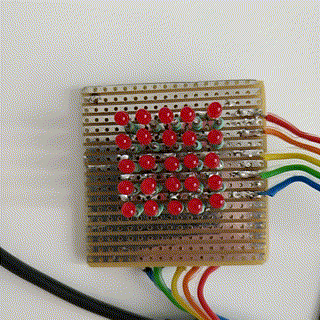

# 5x5-LED-display-text-scroller-for-Atmega168PB
A basic text scroller for an LED-bitmap display made during an 8th grade internship at LOGOS Design.
The code is written for the Atmega168PB on an Xplained Mini board.

## Here it is : )

